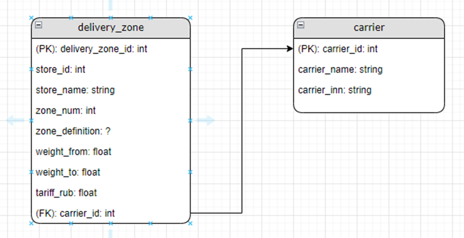

<h1 align="center">
Задание Data Partner
</h1>

# **1.**	Дана ER-диаграмма, в которой показана связь зон доставки `delivery_zone` магазинов и экспедиторов, которые выполняют доставки в эти зоны `carrier`. 



## **a.** Напишите sql запрос, который выведет экспедитора, который выполняет доставку в наибольшее число зон доставки.

<table>
<thead>
<tr><td>Code<td></tr>
</thead>
<tbody>
<tr>
<td>

```sql
SELECT c.carrier_name,
    COUNT(dz.delivery_zone_id) AS zones_count
FROM delivery_zone AS dz
LEFT OUTER JOIN carrier AS c ON dz.carrier_id = c.carrier_id
GROUP BY c.carrier_id, c.carrier_name
ORDER BY zones_count DESC
LIMIT 1;
```
<td>  
</tr>
</tbody>
</table>

(Я использую LEFT OUTER JOIN, только в том случае если у каждого экспедитора есть зона доставки, в инном случае INNER JOIN)

## **b.** Какой тип атрибута для `zone_definition` вы бы предложили, если учесть что `zone_definition` будет использоваться для отображения области зоны доставки в сервисах навигации (2Гис / Яндекс Карты и тд)? 

В случае если мы хотим использовать в атрибуте `zone_definition` географические данные для отображения областей, мы должны использовать пространственный тип даных.
Далее буду отвечать на вопрос относительно СУБД **PostgreSQL**.
Для СУБД **PostgreSQL** существует **расширение PostGIS**, в котором есть тип данных `GEOMETRY` можно использвать его или для областей `POLYGON` если зона одна, в случае если зона состоит из нескольких несвязанных частей `MULTIPOLYGON`.

## **с.** Какие бы предложения по изменению схемы вы бы предложили для приведения схемы к третьей нормальной форме? 

Третья нормальная форма требует, чтобы схема была во второй нормальной форме, а значит все не ключевые атрибуты должны быть функционально зависимы исключительно от первичного ключа. 
Я бы предложил следющие изменения для приведения схемы к третьей нормальной форме:

- Изолировать атрибуты, которые зависят от других ключей.
  Вынести атрибут `store_name` в отдельную таблицу `store`, но при условии что `store_name` зависит от атрибута `store_id`.

- Проверить наличие других свзяей с атрибутом `store_id` и убедиться, что все атрибуты зависят только от первичного ключа `delivery_zone_id`.

## **d.** Какие можно было бы сделать изменения в схеме, если на одну и ту же зону доставки может быть несколько экспедиторов? 

В случе если бы на одну и ту же зону доставки может быть несколько экспедиторов, то стоило бы сделать изменеия в схеме и изменить связь на многие-ко-многим. 
Чтобы изменить схему для поддержки отношения "многие ко многим":

**1.** Удалить внешний ключ `carrier_id` из таблицы `delivery_zone`, так как теперь одна зона доставки может быть связана с несколькими экспедиторами.

**2.** Создать новую промежуточную таблицу, например `delivery_zone_carrier`, которая будет содержать внешние ключи, ссылающиеся на первичные ключи таблиц `delivery_zone` и `carrier`.

## **e.** Как будет в таком случае (с учетом п. c,d) модифицирован sql запрос (п. a)? 

<table>
<thead>
<tr><td>Code<td>Result</tr>
</thead>
<tbody>
<tr>
<td>

```sql
SELECT c.carrier_name,
       COUNT(dzc.delivery_zone_id) AS zones_count
FROM carrier AS c
LEFT OUTER JOIN delivery_zone_carrier AS dzc ON c.carrier_id = dzc.carrier_id
GROUP BY c.carrier_id, c.carrier_name
ORDER BY zones_count DESC
LIMIT 1;
```
<td>  
   

</tr>
</tbody>
</table>

# **2.** Есть api endpoint: https://api.data.gov.sg/v1/environment/air-temperature

## **a.** Что можно получить по данному сервису?
API по адресу https://api.data.gov.sg/v1/environment/air-temperature предоставляет данные о температуре воздуха. Данные включают в себя текущие значения температуры, измеряемые различными станциями. Пользователи могут запрашивать данные за конкретные даты и времена, и по определённым географическим координатам.

## **b.** Как бы вы сделали документацию этого сервиса для коллег в роли разработчика?
Для создания документации API для коллег-разработчиков, я бы предложил следующий план:

1. Обзор API
- Краткое описание API и его назначение.
2. Базовый URL
- Предоставление базового URL API.
3. Методы API
- Описание доступных методов (например, GET), параметров запроса, типов данных и форматов ответа.
- Примеры запросов и ответов.
4. Параметры запроса
- Детальное описание каждого параметра (например, date_time, lat, lon), включая требуемый формат и ограничения.
5. Форматы ответа
- Описание структуры данных ответа, включая все возможные поля и их значения.
6. Обработка ошибок
- Информация о том, как API сообщает об ошибках, включая коды состояния HTTP и тело сообщения об ошибке.
7. Примеры использования
- Практические примеры того, как использовать API.

Для написания более подбробной домукентации нужно больше информации например: об ограничениях колличества запросов, безопаности и т.п.

## **c.** Алгоритм импорта данных этого сервиса:

<table>
<thead>
<tr>
    <td>Code</td>
</tr>
<tr>
    <td>Result</td>
</tr>
</thead>
<tbody>
<tr>
    <td>

```python
import requests

def get_air_temperature():
    url = "https://api.data.gov.sg/v1/environment/air-temperature"
    response = requests.get(url)
    if response.status_code == 200:
        data = response.json()
        if data and 'items' in data and data['items']:
            # Получение первого элемента списка, который содержит данные температуры
            temperature_records = data['items'][0]['readings']
            for record in temperature_records:
                station_id = record['station_id']
                temperature = record['value']
                print(f"Станция {station_id}: Температура воздуха составляет {temperature}°C.")
        else:
            print("Данные о температуре не найдены.")
    else:
        print(f"Ошибка получения данных: {response.status_code}")
 ```       
</td>
</tr>
<tr>
<td>

</td>
</tr>
</tbody>
</table>

Эта функция `get_air_temperature()` обращается к API за данными о температуре воздуха, обрабатывает JSON-ответ и выводит информацию о температуре по каждой станции.

# **3.** В крупной организации есть проблема с поддержанием документации в актуальном состоянии. Состав команд часто меняется, многие авторы страниц базы знаний уже давно не работают в организации. Из-за этого страдает скорость разработки в компании в целом. Предложите 3 пункта, которые вы внесли бы на уровень директора компании для решения данного вопроса.    

## **1.** Внедрение процедур управления документацией: 
Можно внедрить формальный процесс управления документацией, который требует регулярного обновления и проверки актуальности всех документов. Для этого можно назначить ответственное лицо или группу лиц, которые будут следить за соблюдением этих процедур и будут иметь полномочия на обновление и удаление устаревших материалов.

## **2.** Проводить регулярные семинары и обучение по написанию документации: 
Чтобы убедиться, что сотрудники знают, как создавать и обновлять документацию. Включить в программу обучения сотрудников лучшие практики написания документации, инструменты и методы для ее совместного редактирования и упрощения процесса поиска необходимой информации.

## **3.** Интегровать системы контроля версий: 
Интегрировать систему контроля версий для отслеживания изменений в документации и разработке программного обеспечения. Добавьте карточки к каждой странице документации, включая автора, дату создания, дату последнего обновления и дату планового обновления. Это поможет идентифицировать устаревшие материалы и обеспечит отслеживание изменений, вносимых разными авторами.

**поддержание актуальности документации и процессов, связанных с документооборотом, может быть частью работы системного аналитика
